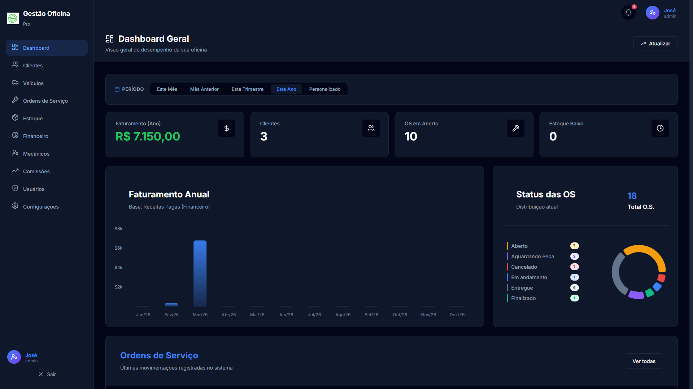
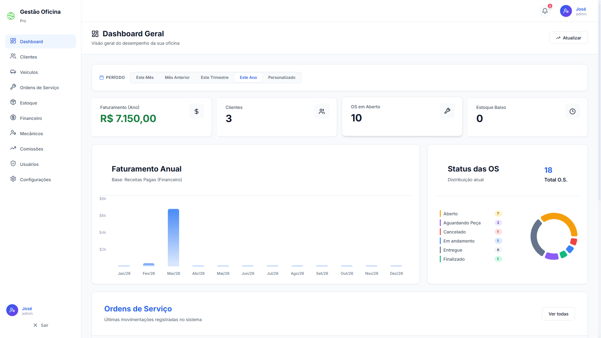

# 🛠️ Gestão de Oficina

Sistema administrativo completo e moderno para gestão de oficinas mecânicas, focado em alta produtividade, controle financeiro rigoroso e gestão inteligente de inventário.





## 🚀 Principais Funcionalidades

### 📋 Gestão de Ordens de Serviço (O.S.)
- **Fluxo Transacional**: Edição de serviços e peças com modo de rascunho. As alterações só são salvas ao confirmar, permitindo descartar rascunhos sem afetar o estoque real.
- **Cálculo Automático**: Totais de mão de obra e peças atualizados em tempo real com suporte a descontos.
- **Impressão Profissional**: Geração de documentos prontos para entrega ao cliente.

### 📦 Controle de Inventário Inteligente
- **Baixa Automática**: Integração direta com a O.S. — o estoque é reservado e baixado automaticamente no salvamento.
- **Histórico de Movimentações**: Registro detalhado de cada entrada e saída, com motivo e referência da O.S.
- **Verificação de Disponibilidade**: Validação em nível de banco de dados para evitar vendas de produtos sem estoque.

### 👥 Clientes e Frota
- **Cadastro Centralizado**: Gestão completa de clientes e seus respectivos veículos.
- **Histórico por Veículo**: Visualize rapidamente todos os serviços realizados em um veículo específico para diagnósticos mais precisos.

### 💰 Gestão Financeira & Lembretes
- **Lançamentos Parcelados**: Flexibilidade total para criar contas a receber ou pagar em até 48 parcelas mensais automáticas.
- **Rastreabilidade**: Todas as parcelas geradas mantêm o vínculo com a Ordem de Serviço de origem (`os id`).
- **Sistema de Alertas**: Campainha de notificações inteligente que monitora pagamentos pendentes e vencidos em tempo real.
- **Relatórios**: Acompanhamento de faturamento mensal e produtividade diretamente no Dashboard.

### 🎨 Experiência de Uso Premium
- **Modo Escuro e Claro**: Suporte nativo a temas para maior conforto visual.
- **Interface Responsiva**: Acessível via PC, tablets e smartphones.
- **Design Moderno**: Navegação fluida com barras de rolagem personalizadas e ícones intuitivos.

### 🌐 Conectividade em Rede
- **Acesso Multidispositivo**: Configurado para funcionar em rede local, permitindo que mecânicos acessem a O.S. diretamente do pátio via celular.

## 🛠️ Tecnologias Utilizadas

- **Frontend**: [React.js](https://reactjs.org/) + [Vite](https://vitejs.dev/)
- **Backend**: [Node.js](https://nodejs.org/) + [Express](https://expressjs.com/)
- **Banco de Dados**: [MySQL](https://www.mysql.com/)
- **Estilização**: CSS Vanilla (Design Premium & Glassmorphism)
- **Ícones**: [Lucide React](https://lucide.dev/)

## ⚙️ Configuração do Ambiente

### Pré-requisitos
- Node.js (v24 ou superior)
- npm (v11 ou superior)
- MySQL Server (v8 ou superior)

### 1. Clonar o Repositório
```bash
git clone https://github.com/GUTIERRES-RS/GestaoOficina.git
cd GestaoOficina
```

### 2. Configurar o Banco de Dados e Backend
- Importe o arquivo SQL localizado em `gestao-oficina-api/database/init.sql` para o seu servidor MySQL.
- Configure as credenciais no arquivo `.env` dentro da pasta `gestao-oficina-api`. Utilize o arquivo `.env.example` como base.
- **Suporte a HTTPS na API (Opcional):** Você pode habilitar o trafego HTTPS configurando `USE_HTTPS=true` no `.env`. Você exigirá par de chaves de segurança.
   - **Gerar Certificados Locais Facilmente**: Dentro da pasta `gestao-oficina-api`, apenas rode `node generate-ssl.js`. Isso vai criar instantaneamente certificados autoassinados na pasta `/certs` com as chaves corretas e você já ficará protegido no IP de sua sub-rede!
   - Alternativamente, insira o caminho dos seus certificados Let's Encrypt reais validando as rotas da sua nuvem:
  ```env
  USE_HTTPS=true
  SSL_KEY_PATH=caminho/para/seu/privkey.pem
  SSL_CERT_PATH=caminho/para/seu/fullchain.pem
  ```

### 3. Configurar o Frontend
- Dentro da pasta `gestao-oficina`, crie um arquivo `.env` (baseie-se no `.env.example`).
- Informe o IP ou domínio onde a API do backend está hospedada:
  ```env
  VITE_API_URL=http://<IP-DO-BACKEND>:3000/api
  ```

### 4. Instalação e Execução

**Backend:**
```bash
cd gestao-oficina-api
npm install
npm start
```

**Frontend:**
```bash
cd gestao-oficina
npm install
npm run dev
# ou para compilar e iniciar em modo preview (produção)
# npm run build && npm run preview
```

## 📖 Guia de Operação

1. **Monitoramento**: Use o **Dashboard** para acompanhar o faturamento, estoque baixo e ordens de serviço em aberto.
2. **Ordens de Serviço**: No menu "Serviços", crie ou edite O.S. Adicione peças e serviços. Use o modo **Rascunho** para testar orçamentos sem comprometer o estoque.
3. **Gestão de Inventário**: Cadastre peças e monitore o estoque mínimo. O sistema dará baixa automática assim que a O.S. for salva.
4. **Financeiro e Alertas**: Fique de olho na **Campainha de Notificações**. Além dos alertas, utilize o **Meio de Pagamento: Parcelado** para dividir cobranças ou despesas em múltiplas parcelas com agendamento automático mensal.
5. **Acesso em Rede (Servidores Separados)**: Para acessar o sistema de qualquer dispositivo ou servidor diferente:
   - Configure a variável `VITE_API_URL` no `.env` do frontend para apontar para o IP do Servidor do Backend (ex: `http://192.168.1.10:3000/api`).
   - Acesse a aplicação web pelo IP do servidor Frontend no navegador (ex: `http://[IP-DO-FRONTEND]:5173`).
6. **Personalização**: Vá em "Configurações" para alterar o logo da oficina, nome da empresa e dados de perfil.

---
Desenvolvido com foco na eficiência automotiva. 🚗💨
